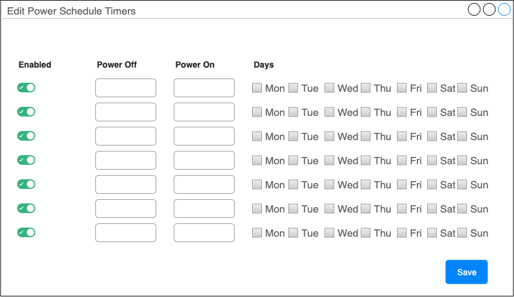

# Fusion Signage - Front-end Engineer Practical Test

## Requirements

Fusion Signage is a digital signage company that allows customers to play videos and images on their digital displays. As part of the remote management of these displays, customers can control the times their displays turn off and on every day.

Using **NextJS** or an equivalent framework that provides both server-side and client-side rendering, create a small application where users can fill out a form, specifying the times their digital displays should power off and then power on again.

## Implementation

1. Build the form in **React**. Use any CSS framework of your choice.
2. Invoke the provided `savePowerTimers` function but **do not** implement this function — it is stubbed. This stubbed function assumes access to required API keys or secrets, meaning it cannot be called client-side.
3. Be creative with your solution, the provided mock-up is for clarity only.
4. Ensure your implementation includes some level of test coverage. Use your judgment here.


\
*Example mock-up for clarity*

## Guidance

- Spend at most **2 hours** on this task.
- If any questions arise, make reasonable assumptions and document them as part of your solution.

## Validation Rules

1. If enabled, each timer must have at least one **day** selected.
2. If enabled, each timer must specify both a **power off time** and a **power on time**.
3. A maximum of **7 timers** can be submitted.
4. A **power off time** can occur prior to a **power on time** if it crosses into the next day. For simplicity, you **do not** need to validate if power off is less than or greater than power on.

## Implementation Notes

- The `savePowerTimers` call may timeout or fail unexpectedly. Ensure users are informed of these situations.
- The `savePowerTimers` function may take **10 to 30 seconds** to respond in extreme cases. Ensure this worst-case delay is handled in the design.

---

### Types

```ts
export type PowerTimer = {
  timerNumber: number;
  enabled: boolean;
  powerOffTime: string; // hh24:mm
  powerOnTime: string; // hh24:mm
  daysOfWeek: string[]; // "MONDAY" | "TUESDAY" | "WEDNESDAY" | "THURSDAY" | "FRIDAY" | "SATURDAY" | "SUNDAY"
};
```

### Stubbed Function

The following function is **stubbed** and **must not be implemented**. This function requires interaction with API keys/secrets and therefore cannot be called client-side:

```ts
export function savePowerTimers(powerTimers: PowerTimer[]): Promise<void> {
  // Stubbed function. Do not implement or modify.
}
```

When ready, call the `savePowerTimers` function after validating your timers. Note that this function will throw a **4xx error** for invalid timers (assume no error message will be provided by the API). Ensure validations are in place before invoking the function.
